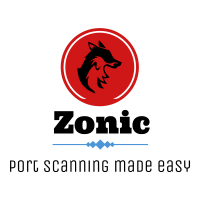

=========
zonic
=========

.. image:: https://img.shields.io/pypi/v/zonic.svg
        :target: https://pypi.python.org/pypi/zonic

.. image:: https://img.shields.io/travis/symonk/zonic.svg
        :target: https://travis-ci.com/symonk/zonic

.. image:: https://readthedocs.org/projects/zonic/badge/?version=latest
        :target: https://zonic.readthedocs.io/en/latest/?badge=latest
        :alt: Documentation Status

.. image:: https://pyup.io/repos/github/symonk/zonic/shield.svg
     :target: https://pyup.io/repos/github/symonk/zonic/
     :alt: Updates

.. image:: https://results.pre-commit.ci/badge/github/symonk/zonic/master.svg
   :target: https://results.pre-commit.ci/latest/github/symonk/zonic/master
   :alt: pre-commit.ci status

.. image:: https://codecov.io/gh/symonk/zonic/branch/master/graph/badge.svg
  :target: https://codecov.io/gh/symonk/zonic

Port scanning made easy with python

* Free software: MIT license
* Documentation: https://zonic.readthedocs.io.

--------
Disclaimer
--------
Do **not** use this against any environment in which you do not have complete, explicit permission to conduct such scanning.

Features
--------

* Simple port scanner
* Extendible through a plugin system
